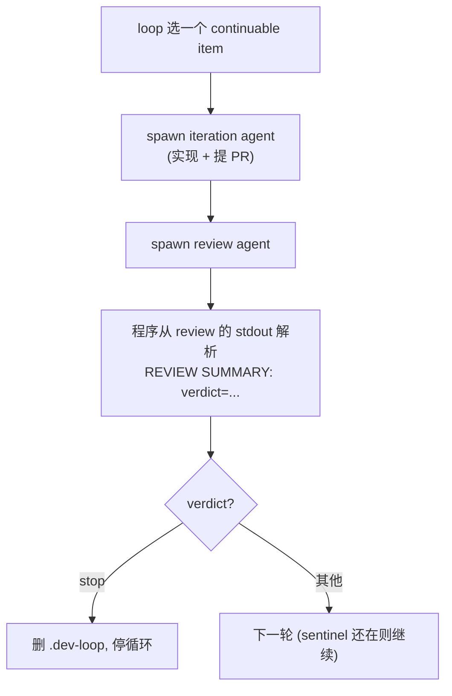

# v1 架构：单进程迭代引擎（代码实然）

> 本文讲 `stable-v1`（tip `79f16e4`）**代码实际**怎么写、怎么跑，行号引用都指向该固定快照。
>
> 重要前提：README 和 `#5` 描述的是**设计理想**——引擎"字符串无感"（不认识 phase 名、状态字面量、verdict 词表）、业务语义全部数据驱动地来自 preset、判断全交 LLM。**v1 代码远未达到这个理想**：状态语义、verdict 词表、status 字面量、phase 顺序大量**写死在 `src/loop.ts`**。本文以代码实然为准，最后一节专讲它与理想契约的差距——那才是 v1→v2→v3 演变的真正主线。

## 一、它实际在干什么

v1 是一个 `bun src/loop.ts --target-cwd <repo>` 单进程，在一个 target repo 上循环消费一个 issue 队列。规划（plan，`/dev-plan`）在循环**之外**完成；loop 进程本身只跑两个 phase：**iteration** 和 **review**。

一个 issue 在 v1 里的实际流程：

## 二、v1 的状态机制（代码实然）

这是最关键、也是本仓库历史文档此前写糊的地方。v1 的状态要分两层看，不能笼统说"归 agent"或"归 preset"：

- **item.status 字段**：基本由 **agent 写**——review 角色经 preset 的 `review/update-state` fragment 把新状态落进 `state.json`，引擎只读 + reconcile；程序唯一直接写 `item.status` 的地方是 `queue unblock` 的 `blocked → queued`（`stable-v1:src/loop.ts:2494-2498`）。
- **状态的"规则"（什么是合法状态、verdict 词表、verdict 如何影响流程、kind 如何路由）**：全部**写死在 `src/loop.ts`，不在 preset**。这才是"状态不在 preset 而在程序"的准确含义——不是 agent 不写字段，而是状态的**语义规则**焊死在引擎。

状态规则写死的具体证据：

- review agent 在 stdout 末行打 `REVIEW SUMMARY: verdict=(retry|accepted|skip|blocked|stop);`；程序用**写死的正则**解析（`parseReviewSummaryVerdictFromText`，`:3501-3505`），可接受的 verdict 词表 `ReviewSummaryVerdict` **写死在程序类型里**（`:717`）。
- 程序据解析出的 verdict 用**写死的逻辑**控制流程，例如 `verdict === "stop"` 就删 `.dev-loop` 停循环（`:1577`）。
- `kind="blocked"` 被程序直接映射到具体 fragment `iter/resolve-blocker`（`:3242`）——引擎知道某 preset 的内部 fragment。
- `preset.toml` 里虽有 `[statuses]`（`:26-28`），但 v1 程序的解析、推导、流程控制**不由它驱动**。

**结论：v1 里状态字段虽多由 agent 落盘，但状态的"规则"（合法集、verdict 词表、流程映射、kind 路由）写死在引擎、不在 preset。** README / `#5` 说的"引擎不知道状态字面量、状态归 preset"在 v1 代码里并不成立——这正是今天（`#386` 等）才开始往 preset 迁的东西。

## 三、运行形态

- 单进程 while-loop，守 target 下的 `.dev-loop` sentinel（在 = 继续，删 = 退出），串行处理，一次一个 item、一个 phase。
- spawn：`detached` child，runner 为 `claude` / `codex`。
- 持久化：target 下 `.coder-loop/runtime/` 的 JSON（`state.json` 等）+ sentinel 文件。**无 daemon、无 scheduler、无 SQLite**——这是 v1 的定义性特征。
- `stable-v1` 里也有 `daemon start/stop` 子命令，但它只是把这个单进程放后台，不是常驻调度进程。判断 v1/v2 看的是执行模型有没有变成"中央 daemon + 调度器 + chain + SQLite"。

## 四、v1 代码 vs 理想契约（#5）—— 真正的演变主线

`#5` 的理想是引擎字符串无感、业务语义数据驱动地来自 preset。v1 代码与此的差距：

| 维度 | `#5` 理想 | v1 代码实然（写死在 loop.ts） |
|---|---|---|
| 状态合法集 / 转换 | 归 preset `[statuses]` | verdict 解析 + 状态转换写死（`:717` `:3504` `:2498`） |
| review verdict 词表 | preset 定义 | `ReviewSummaryVerdict` 写死（`:717`） |
| phase 顺序 | preset 驱动 | iteration / review 写死在主循环 |
| issue-kind 路由 | preset prompt | 程序映射，如 `kind="blocked" → iter/resolve-blocker`（`:3242`） |

把这些写死项真正迁到 preset，是 v2 之后、**直到今天（2026-06）仍在进行**的工作——例如 `#381`（phase metadata 入 preset.toml）、`#380`（phase order 由 preset 驱动）、`#373`（item PR 字段 preset 声明）、`#376`（issue-kind 路由入 preset prompt）、`#386`（queue unblock 由 preset statuses 驱动）。`#369` / `#370`（v3）继续这条线。

**这条"把写死在引擎里的业务语义逐步迁出、迁进 preset"的迁移，才是 v1→v2→v3 的真正主线**；daemon 化（见 `architecture-v2.md`）是并行的另一条线，它换的是执行模型，不解决业务语义硬编码。两条线不要混为一谈。
