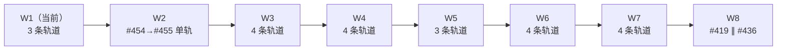

# v3 前 issue 执行计划（调度者手册）

> 更新于 2026-06-12（第 6 版）。本文件的读者是**调度者**——负责按下方波次表启动任务区块、观察完成、推进下一波的 agent。波次表是操作员已裁决的执行顺序，**不是建议**：不得提前、不得重排、不得合并或拆分轨道。遇到本文件未覆盖的情况，停下报告操作员，不要自行变通。

## 运行形态（只读事实）

- 调度命令是 PATH 上的 `coder-loop`（运行版）。被迭代的代码仓库是 `/Users/mouriya/Ext/code/coder-loop`（GitHub: `mouriya-s-lab/coder-loop`），这是两个不同的东西，不要混淆。
- 迭代由引擎自动完成：引擎会从「起点 clone」自己创建 git worktree 并在其中跑 agent。调度者不创建 worktree、不进 worktree、不改任何仓库内容。
- **并行模型**：一条 chain 内严格串行（一次只跑一个 item）。要并行就开多条 chain，且**每条同时活跃的 chain 必须使用一份独立的起点 clone**——禁止两条活跃 chain 共用同一份 clone。
- 起点 clone 池：lane1 = `/Users/mouriya/Ext/code/coder-loop`（主 clone）；额外轨道用 `/Users/mouriya/Ext/code/coder-loop-lane2`、`-lane3`…（不存在就 `git clone https://github.com/mouriya-s-lab/coder-loop.git <path>` 建一份）。

## 每次开工前的检查

1. daemon 判活：`lsof ~/.coder-loop/loop-data/daemon.sock` 必须有进程在监听。没有 → 停下报告操作员，**不要自己启动、杀或重启 daemon**。
2. `gh auth status` 活跃账号必须是 `RiriAgent`。
3. 本波每条轨道的起点 clone 更新到最新 main：`git -C <clone> checkout main && git -C <clone> pull --ff-only`。失败（有本地改动 / 不在 main）→ 停下报告，不要 reset。

## 启动一个任务区块（轨道）

一条轨道 = 一条 chain = 一份独立 clone = 波次表里的一个并行成员（单 issue，或括号内的串行组）。

```sh
# 1. 建 chain（名字约定：cl-w<波次>-<issue 号>，串行组用 cl-w<波次>-<首尾号>）
coder-loop chain create <chain名> \
  --config-json '{"repository":"mouriya-s-lab/coder-loop","baseBranch":"main"}' \
  --preset gh-issue-pr-iteration --json

# 2. 加 item（串行组按执行顺序逐个 add 进同一条 chain）
coder-loop item add <chain名> --issue <N> --repo-cwd <该轨道的 clone 绝对路径> --json

# 3. 启动调度
coder-loop daemon start <该轨道的 clone 绝对路径> --chain <chain名> --json
```

## 观察与完成判定

- 看进度：`coder-loop chain status <chain名> --json`（item 状态）或 `coder-loop status <clone路径> --json --chain <chain名>`。轮询间隔 ≥ 5 分钟即可，agent 一轮迭代通常几十分钟。
- **轨道完成** = chain 的全部 item 到 `done`，且每个 item 对应的 PR 已 merged（`gh pr list -R mouriya-s-lab/coder-loop --search "<issue号>" --state merged` 核对）。
- **异常**（item 进 `blocked`、chain 变 `stopped`、长时间无 run 推进、daemon 不再监听）→ 停止推进该轨道并报告操作员。不要 `queue unblock`、不要删 chain、不要重启任何东西。

## 波次推进规则

- 一个波次的**全部**轨道完成（含 PR merged）后，才允许启动下一波的任何轨道。
- 开下一波前重做「每次开工前的检查」第 3 步（clone 更新）——上一波合并的 PR 必须进到每条新轨道的起点。
- W1 的 #429 完成是 W2 的硬性闸门（它修正后续各 issue 的验收命令），不得以「#429 不产 PR」为由放行。
- 实施 agent 报告「issue 验收命令不可执行 / 与现实冲突」属正常现象（issue 树先行改向、代码后到），不算轨道异常——该 agent 会按合同先修 issue 再交 PR，调度者无需介入。

## 波次表

| 波次 | 并行轨道（每条 ∥ 成员一条 chain；括号内串行组同一条 chain 按序 add） | 进入条件 / 说明 |
|---|---|---|
| W1 | #411 ∥ #428 ∥ #429 | **当前波次，立即可开**，3 条轨道；#429 完成是 W2 闸门；#449 已关闭（not planned，preset 重构吸收） |
| W2 | (#454→#455) | 单轨（类型权威树头，引擎全域类型改造，不与任何人并行） |
| W3 | (#412→#433) ∥ (#399→#448) ∥ #400 ∥ #458 | 4 条轨道 |
| W4 | #397 ∥ (#450→#420→#401) ∥ #402 ∥ #434 | 4 条轨道 |
| W5 | #406 ∥ #451 ∥ #457 | 3 条轨道 |
| W6 | #407 ∥ #405 ∥ #403 ∥ #404 | 4 条轨道 |
| W7 | (#409→#410) ∥ #408 ∥ #452 ∥ #456 | 4 条轨道；#409→#410 顺序可对调但必须串行 |
| W8 | #419 ∥ #436 | 2 条轨道，收尾 |



## 禁止事项

- 不修改 `~/.coder-loop/` 下任何文件；不读写 chain 的 metadata；不直接跑 `bun src/loop.ts`。
- 不修改任何起点 clone 或引擎 worktree 里的代码、不在其中 commit/push——代码工作全部属于引擎 spawn 的 agent。
- 不调整波次表：成员、顺序、串行/并行关系均为操作员裁决；认为有错就报告，不要改了再说。
- 不替实施 agent 在 issue/PR 上留言、不合并 PR、不关 issue——review 与合并由工作流自身完成。
- 本文件由操作员侧维护；issue 树变动时不要自行改写本文件。
