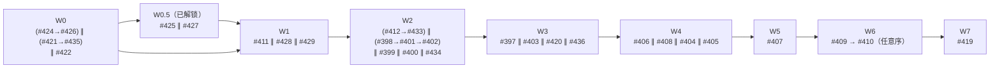

# v3 前 issue 执行计划（波次分组）

> 更新于 2026-06-11（第 3 版：纳入 #428/#429、#430 已关（PR #431 merged）、#432 v2 收尾线 RFC 树（#433–#436、#421 改向））。依赖边的权威来源是各 issue body 的「依赖关系」节（已双向核对、无环），编排约束（contended surface 串行）见 `#396` 的两条编排 comment 与 `#432` 的依赖图节。本文件是它们的执行视图快照——若 issue 树后续变动，以 issue 为准。
>
> 范围：v3（#413/#418/hapi-remote-session#1）之外的全部 open issue——#396 树（#397–#410）、#411、参数收敛线独立 issue（#412、#419–#422）、#423 收尾（#424–#427）、表面退役收尾（#428/#429）、#432 v2 收尾线树（#433–#436）。docs 勘误 #414 已随 PR #415 合并关闭。

## 已完成

- **#417**（agent 生命周期：双重 GC + 引擎 summary tag）— PR #423 merged 2026-06-11T00:58。preset `summaryMarker` 字段已删；衍生收尾 #424/#426（代码）、#427（docs）、#425（docs）。
- **#430**（summary 标签改 per-run 随机 nonce）— PR #431 merged 2026-06-11。推翻 #417「硬编码共享标签」细节；#405/#427 body 已对齐该裁决。
- **#425 的 CLAUDE.md 部分**— 操作员授权直改落地（coder-loop@5647e14）；#425 剩余范围只剩 `docs/` 与 README。
- **#414**（docs v3 定义勘误）— PR #415 merged 2026-06-11T03:25（92986a2）。W0.5 docs 线（#425/#427）即刻解锁。

## 波次表

| 波次 | 并行成员 | 进入条件 / 说明 |
|---|---|---|
| W0（立即） | (#424→#426) ∥ (#421→#435) ∥ #422 | #424/#426 同改 `scheduler.ts` 串行；#421（K5 改向后：label 声明归 preset）与 #435（删 install Layer D）同改 `install-commands.ts` 串行（顺序任意）；#422（binding key 区）零交集。PR #415 已合并（92986a2），不再是 W0 成员 |
| W0.5（已解锁） | #425 ∥ #427 | PR #415 已合并，docs 线即刻可开工；二者互不同段可并行 |
| W1 | **#411** ∥ #428 ∥ #429 | #411 全树 log 义务落点，改动横跨 daemon/scheduler/loop，引擎代码不与任何人并行；#428（presets md 的 plan gate 改真实路径）、#429（树上验收 Command 行批改，纯 issue 维护无 PR）都只依赖 #425，零引擎代码交集。**#429 必须在 W2 开工前完成**——W2 起各实施者要读到可执行的验收行 |
| W2 | (#412→#433) ∥ (#398→#401→#402) ∥ #399 ∥ #400 ∥ #434 | #412（schema + `handleItemAdd`）与 #433（runtime 配置收编 chain.metadata，新增 daemon handler）同 `daemon.ts` surface 串行（契约交互登记「先后任意」，排 #412 在前免 #433 重写回落源两遍）；S2 前段三连同 loader surface 内部串行；#434（workflow.md 退役：`WORKFLOW_FILE` 绑定 + preset md）与 #422 相邻非依赖（W0 已完，实施前核对 key 位置），与 #428（W1 已完）的 fragment 改动无并发 |
| W3 | **#397** ∥ #403 ∥ #420 ∥ #436 | #397（daemon 边界，S1 链首）、#403（loader 状态集）、#420（label 摄入读侧）不同 surface；#436（install/uninstall 退役 capstone + doctor 收缩）前置 #433/#434/#435/#421 至此全部落定，主 surface 是 `install-commands.ts` 整删 + CLI dispatch + docs 收尾，与本波其余成员零交集 |
| W4 | **#406** ∥ #408 ∥ #404 ∥ #405 | 四块不同主 surface：daemon 边界 / 装载期 capstone / presets md / verdict CLI 通道。#405 因新增 daemon handler 与 #397 同文件，错开一波 |
| W5 | **#407** 单独 | S1 串行链：消费 #406 主体和类型，首定义 per-phase 权利段 schema |
| W6 | #409、#410 串行任意序 | 语义可并行（各消费 #407 schema），但同 daemon 调用面 surface。#409 落地后按其凭证规则给 #433 新增的 runtime handler 补归类（两边已登记交叉） |
| W7 | **#419** | 编排裁决排 S1 链后：身份键改动在品牌类型（#397）、凭证绑定（#406）落定之后 |

## 合同漂移收口（已全部有 owner）

直跑 loop / `--check-runtime` / loop 级 `--dry-run` 表面退役引发的三块漂移，第 2 版登记为「待解决」，现各有归属：

- `CLAUDE.md` → 已落地（5647e14，#425 范围缩减 comment 登记）
- `docs/` + README → #425（W0.5）
- `presets/` 内 plan gate → #428（W1）
- 树上 issue 验收 Command 行批改 → #429（W1，gate W2）——在它完成前，实施者遇到死命令按合同规则先修 issue 再交 PR

## 波次依赖图



注：W0.5 只阻塞 docs 线与其下游（#425→#428/#429），#411 与 docs 无文件交集，W0 完成即可开工；W1 行的「∥」对 #411 成立是因为 #428/#429 不碰引擎代码。

## issue 级依赖图（边 = body 登记的 Depends/Blocks）

```mermaid
flowchart TD
  i423["PR #423 / #417 ✅"] --> i411["#411 可观测性"]
  i430["PR #431 / #430 ✅ nonce"] -.修正 #417 细节.-> i405
  i415["PR #415 / #414 ✅"] --> i425["#425 docs 命令漂移"]
  i415 --> i427["#427 docs marker 行"]
  i425 --> i428["#428 presets plan gate"]
  i425 --> i429["#429 验收行批改"]
  i412["#412 per-item preset"] --> i397["#397 出边 default-deny"]
  i412 --> i403
  i412 --> i407
  i397 --> i406["#406 run 凭证"] --> i407["#407 创建权"] --> i409["#409 调用面分级"]
  i407 --> i410["#410 字段写权"]
  i406 --> i409
  i406 --> i410
  i398["#398 verdict 词表"] --> i403["#403 删 fallback"]
  i401["#401 kind 词表"] --> i403
  i402["#402 耗尽落点"] --> i403
  i403 --> i408["#408 DAG capstone"]
  i397 --> i408
  i398 --> i405["#405 verdict 走 CLI"]
  i397 --> i404["#404 md 清洗"]
  i398 --> i404
  i397 --> i419["#419 物理列退役"]
  i406 --> i419
  i412 --> i419
  i401 --> i420["#420 label 摄入移出"]
  i399["#399 占位符校验"]
  i400["#400 fragment 切片"]
  i422["#422 runtime key 分层"]
  i424["#424 RUN_ID_ENV 清理"] --> i426["#426 GC 重构（同文件串行）"]

  subgraph v2tail["#432 树（v2 收尾线）"]
    i433["#433 config 收编 chain.metadata"] --> i436["#436 install 退役 capstone"]
    i434["#434 workflow.md 退役"] --> i436
    i435["#435 skill vendoring 退役"] --> i436
    i421["#421 label bootstrap 归 preset（K5 改向）"] --> i436
  end
  i435 <-. 同改 install-commands.ts 串行 .-> i421
  i433 <-. 契约交互·先后任意 .-> i412
  i409 -.落地后补凭证归类.-> i433
  i434 <-. 相邻非依赖 .-> i422
```

## 要点

- **关键路径不变**：(#417 ✅) → #411 → #412 → #397 → #406 → #407 → #409/#410 → #419，仍七波；#432 树是旁支轨道，全部塞进 W0–W3 的空闲槽（#436 capstone 在 W3 收口），不拉长总时长。
- **并行度峰值移到 W2（5 路）**。用 coder-loop 跑时，同波各路放不同 chain（slot = `(chain, repoCwd)`，同 chain 同 repo 天然串行）；串行对（#424→#426、#421→#435、#412→#433）与 S2 三连各放同一条 chain 天然串行。
- **#429 是 W2 的软 gate**：它不阻塞任何代码，但 W2 起的实施 agent 要照验收行执行命令——死命令未批改前，每个实施者都要自己撞一次「先修 issue」。
- **「#412 在 #411 之后」不是必要依赖边**，是总纲建议（事件发射有统一落点），登记在 #396 body 实施顺序节。「#412 在 #433 之前」同理是编排建议（#412 先按现状 config 回落实现、#433 负责迁移），两 issue comment 已登记先后任意。
- 刻意保守、接受 rebase 成本可提前的点：#405 可提前到 W3（与 #397 同 `daemon.ts` 并发重写风险）；#409/#410 可并行（共用调用面 surface）；#433/#434 可提前到 W1（代价是与 #411 的 `loop.ts` 改动并发 rebase）。
- #432 树与 v3（#413）无依赖；#420（label 读侧）、#419（物理列）、#409（授权分级）、#411（可观测性）都被 #432 显式划出范围，各自独立推进——#411 body 中「doctor / install 本地装载」一句的 install 部分随 #436 作废（已 comment 登记，实施时以届时 CLI 实态为准）。
